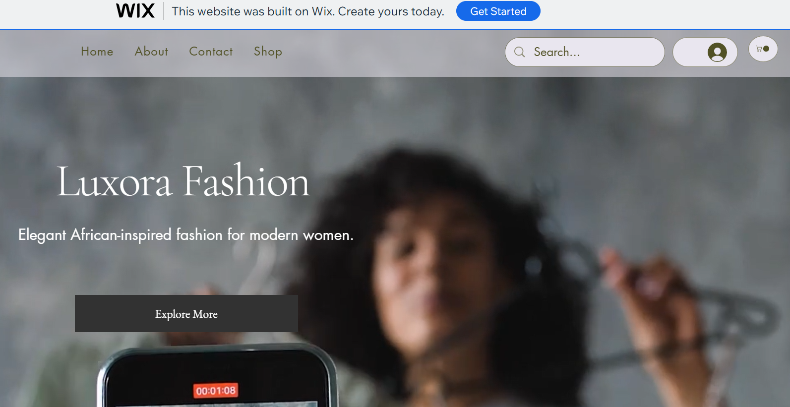
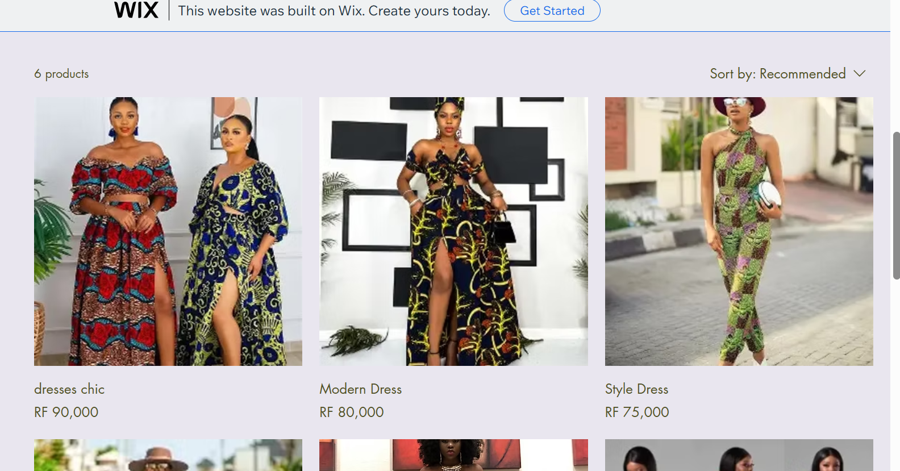

Name: Loriana Eline 
Regno:19588/2022

 Project Title
Luxora Fashion - Online Women Clothing Store

 Project Description
This project is a simple e-commerce website called Luxora Fashion. It was created using Wix . The website is designed for African women and offers modern, elegant, and affordable clothing for everyday wear and special occasions.

 Platform Used
Wix Website Builder (No-Code Tool)

 Features of the Website
- Homepage with brand introduction
- Product page with 5 fashion items
- About page describing the brand
- Contact page with contact form and details
- Shopping cart functionality (Wix Stores)

Products Included
- African Elegance Dress  
- Luxury Evening Dress  
- Floral Summer Dress  
- Style Dress  
- Modern Dress  
- Dresses chic

  Screenshots

  Contact Page

 Homepage

 Products Page

 

 Challenges Faced:
At the beginning, I had some difficulties understanding how Wix works, especially how to organize pages and products. But after practicing, I was able to build the full website step by step.

What I Learned:
I learned how to create an online store using a no-code platform, for me it’s was new experience. I also learned how e-commerce websites are structured and how important design and user experience are.

 Live Website:
https://lorianaeli38.wixsite.com/theluxorafashion 

GitHub Repository:
https://github.com/eline24-1/Luxora-Fashion

 Conclusion:
This project helped me understand the basics of building an e-commerce website without coding. It improved my skills in design, organization, and online business structure.
